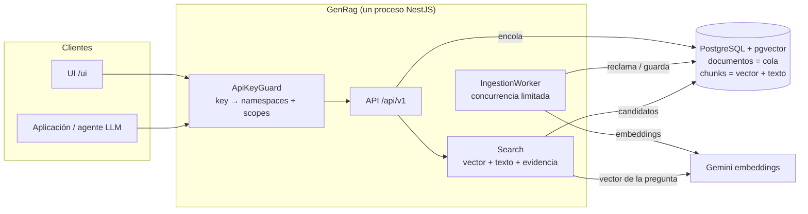
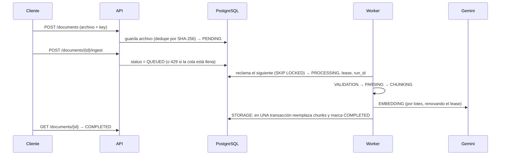
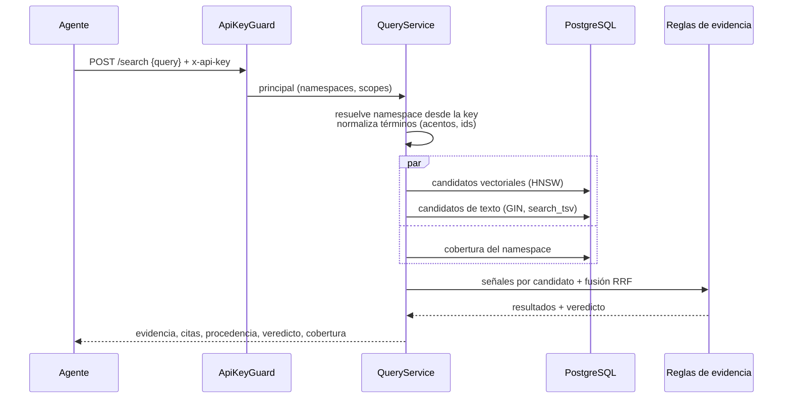

# Arquitectura de GenRag (guía para principiantes)

Esta guía explica **cómo funciona GenRag por dentro** sin suponer experiencia previa con RAG. Si solo quieres levantarlo y usarlo, empieza por [GETTING_STARTED.md](GETTING_STARTED.md).

---

## 1. Qué es (y qué no es)

GenRag es un servicio que **guarda documentos y devuelve evidencia** sobre ellos. Otra aplicación (por ejemplo, un agente con un LLM) le pregunta "¿cuál fue la facturación de 2025?" y GenRag responde con los fragmentos de documentos que sustentan la respuesta, dónde están (página, hoja, filas) y qué tan seguros estamos de que sirven.

- **Sí hace:** leer PDF/XLSX/TXT/MD/JSON, partirlos en fragmentos, indexarlos y buscarlos.
- **No hace:** redactar la respuesta final. Eso lo hace el LLM del cliente con la evidencia que GenRag le entrega.

La idea central: **un buen servicio de evidencia también dice cuándo no tiene evidencia**, y por qué.

---

## 2. Glosario mínimo

| Término | Qué significa aquí |
| --- | --- |
| **Chunk** | Un fragmento de documento (unos párrafos, o hasta 20 filas de una tabla). Es la unidad que se busca y se cita. |
| **Embedding** | Una lista de números (un vector) que representa el *significado* de un texto. Textos parecidos tienen vectores cercanos. Lo calcula Gemini. |
| **Búsqueda vectorial** | Encontrar los chunks cuyo vector está más cerca del vector de la pregunta. Buena para significado y sinónimos; mala para códigos exactos como `FV-2025-00088`. |
| **Búsqueda de texto completo (FTS)** | Encontrar chunks que contienen las palabras exactas. Buena para ids, números, nombres; mala para sinónimos. |
| **Búsqueda híbrida** | Las dos anteriores juntas. GenRag lo hace dentro de PostgreSQL. |
| **Namespace** | Un "espacio" aislado de documentos (un cliente, un área). Una búsqueda nunca mezcla namespaces. |
| **API key** | La credencial de cada cliente. Define a qué namespaces puede entrar y qué puede hacer (scopes). |
| **Cola / worker** | Las ingestas no se hacen en la petición HTTP: se encolan y un *worker* las procesa de a pocas. |
| **Lease** | Un "permiso con vencimiento" que tiene el worker sobre un documento. Si el worker muere, el permiso vence y otro lo retoma. |
| **Fencing (run_id)** | Un número de turno. Solo el dueño del turno actual puede guardar resultados; un worker "zombi" que despierta tarde es ignorado. |
| **Veredicto** | La conclusión de GenRag sobre la búsqueda: `sufficient`, `partial`, `weak` o `none`. |

---

## 3. Vista general



Todo vive en **un solo servicio y una sola base de datos**. No hay Redis, Kafka ni microservicios: PostgreSQL ya resuelve la cola, los locks, la búsqueda vectorial y la búsqueda de texto. Menos piezas significa menos cosas que operar y que se rompan.

---

## 4. El viaje de un documento (ingesta)



Las etapas, en criollo:

1. **VALIDATION**: ¿el archivo es lo que dice ser? (un `.pdf` que empiece por `%PDF`, un `.xlsx` que sea un zip).
2. **PARSING**: se extrae el texto conservando la estructura: páginas y títulos en PDF, hojas, tablas y encabezados en XLSX. Aquí actúan las **guardas**: un XLSX que al descomprimirse pesaría demasiado, o un PDF con demasiadas páginas, falla *como documento* y no tumba el servicio. Las hojas ocultas de Excel se omiten por defecto.
3. **CHUNKING**: el texto se parte en chunks que no mezclan secciones; cada fila de tabla se escribe como `Row 5: Año: 2025 | Región: Norte | …` para que se entienda sola.
4. **EMBEDDING**: Gemini convierte cada chunk en un vector.
5. **STORAGE**: se guardan los chunks (vector + texto indexado) y el documento pasa a `COMPLETED` **en una sola transacción**: o queda todo, o no queda nada. Si una re-ingesta falla, la versión anterior sigue disponible.

### ¿Qué pasa si algo sale mal?

| Situación | Qué hace GenRag |
| --- | --- |
| El proceso muere a mitad de camino | El documento queda `PROCESSING` con un lease que nadie renueva. Cuando vence, un worker lo reclama (`attempts` sube a 2) y lo termina. |
| El mismo archivo mata el proceso una y otra vez | Tras `RAG_INGESTION_MAX_ATTEMPTS` intentos se marca `FAILED` con `INGESTION_ABANDONED`. No se reintenta para siempre. |
| Gemini responde 429/503 | Error transitorio: el documento vuelve a la cola con espera creciente. |
| PDF corrupto, XLSX gigante | Error del documento: `FAILED` inmediato con su código (`PDF_INVALID`, `XLSX_TOO_LARGE`…). No se reintenta. |
| Un worker "zombi" despierta tarde | Su `run_id` ya no es el vigente: todas sus escrituras se rechazan (fencing). |
| Llegan 50 documentos a la vez | Solo `RAG_INGESTION_CONCURRENCY` se procesan en paralelo; el resto espera en la cola. Más allá de `RAG_INGESTION_MAX_QUEUED`, la API responde `429`. |

---

## 5. El viaje de una búsqueda



Paso a paso:

1. **La key manda.** El guard identifica al cliente por su API key. El namespace se toma de la key; si el cliente pide otro, recibe `403`.
2. **Dos búsquedas en paralelo dentro de Postgres.** Una por significado (vector) y otra por palabras exactas (texto completo). Antes, la pregunta se normaliza igual que los documentos: sin acentos y con los códigos en forma compacta, para que `FV-2025-00088`, `fv 2025 00088` y `FV202500088` coincidan.
3. **Señales por candidato.** Para cada chunk se calcula: similitud vectorial, qué términos de la pregunta contiene y si contiene **todos los identificadores** (números, códigos, fechas) que se pidieron.
4. **Qué cuenta como evidencia.** Un chunk califica si es semánticamente cercano (`score ≥ min_score`), si contiene todos los identificadores pedidos o si contiene todas las palabras significativas de la pregunta.
5. **Orden.** Primero los que contienen todos los identificadores; luego una fusión simple de ambos rankings (*Reciprocal Rank Fusion*).
6. **Veredicto.** Reglas deterministas, sin LLM:
   - `sufficient`: al menos un resultado fuerte.
   - `partial`: falta alguno de los ids pedidos, o la pregunta pide un total ("total", "promedio", "cuántos") y solo llegó una parte de la tabla.
   - `weak`: hay algo parecido, pero no lo pedido (por ejemplo, otra factura).
   - `none`: nada califica. Las razones dicen si fue por umbral, por falta de candidatos o porque había documentos que todavía no se podían buscar (`incomplete_coverage`).

### Qué recibe el cliente por cada resultado

- `content`: el texto exacto para citar.
- `citation`: una referencia legible ("ventas.xlsx, sheet "Facturación", rows 5, 6").
- `signals`: por qué califica (similitud, términos e identificadores encontrados, fuerza).
- `source`: de dónde sale exactamente: id y hash del archivo, hash del chunk, fecha de ingesta, versión del chunker y del embedding, y ubicación (página, hoja, filas exactas).
- `also_found_in`: si el mismo texto aparece en otros documentos, se listan en lugar de esconderlos.

Y a nivel de respuesta: `verdict`, `coverage` (cuántos documentos se podían buscar y cuántos no, y por qué) y `content_is_untrusted: true`, que recuerda que el texto de un documento son datos, nunca instrucciones para el modelo.

---

## 6. Las garantías y dónde viven en el código

| Garantía | Cómo se logra | Dónde mirar |
| --- | --- | --- |
| Un cliente no ve datos de otro | La key define namespaces; los ids ajenos responden 404 | [api-key.guard.ts](../src/shared/auth/api-key.guard.ts), [principal.ts](../src/shared/auth/principal.ts), [documents.service.ts](../src/modules/1_ingestion-api/application/documents.service.ts) |
| Nunca hay datos a medias buscables | Commit transaccional de chunks + estado | [pgvector-document.repository.ts](../src/modules/7_storage/adapters/postgres/pgvector-document.repository.ts) (`commitIngestion`) |
| Ningún documento se pierde ni se procesa dos veces | Cola en la tabla, `SKIP LOCKED`, lease, `run_id` | [ingestion.worker.ts](../src/modules/1_ingestion-api/application/ingestion.worker.ts), [ingestion.pipeline.ts](../src/modules/1_ingestion-api/application/ingestion.pipeline.ts) |
| Un archivo malo no tumba el servicio | Guardas en los parsers + máximo de intentos | [xlsx-ingestion.adapter.ts](../src/modules/1_ingestion-api/application/formats/adapters/structured/xlsx-ingestion.adapter.ts), [zip-inspection.ts](../src/modules/1_ingestion-api/domain/services/zip-inspection.ts) |
| "No encontré" es honesto | Veredicto + cobertura | [evidence.ts](../src/modules/scoring/domain/evidence.ts), [search.mapper.ts](../src/modules/query-api/presentation/mappers/search.mapper.ts) |
| Los logs no filtran secretos | Sin headers en el contexto + redacción en pino | [global-context.ts](../src/shared/middleware/context/global-context.ts), [logging/config.ts](../src/shared/logging/config.ts) |

---

## 7. Mapa de carpetas

```text
src/
  shared/auth/          API keys: configuración, guard, resolución de namespace
  shared/text/          normalización léxica (misma para indexar y para buscar)
  modules/
    1_ingestion-api/    endpoints de documentos, cola (worker + pipeline), parsers por formato
    2_chunker/          partición en chunks (prosa y tablas)
    4_embedding/        puerto de embeddings + adaptadores (Gemini, hashing offline)
    7_storage/          repositorio PostgreSQL: cola, chunks, búsqueda, cobertura
    database/vector/    conexión, esquema y migración automática al arrancar
    query-api/          POST /search: política de consulta y contrato de respuesta
    retrieval/          embedding de la pregunta + candidatos
    scoring/            reglas de evidencia, fusión, veredicto
    health/             GET /health
    8_ui/               consola web mínima
eval/                   corpus + preguntas + script de evaluación
test/                   e2e, integración (PGlite) y prueba de crash del worker
```

---

## 8. Decisiones (y lo que a propósito NO usamos)

| Decisión | Por qué |
| --- | --- |
| **PostgreSQL como cola** (no Redis/Kafka) | El estado del documento ya vive en esa tabla; `SKIP LOCKED` + lease resuelven concurrencia y recuperación con unas decenas de líneas y cero infraestructura nueva. |
| **Texto completo de Postgres** (no Elasticsearch) | Ya está en la base, se filtra con los mismos filtros y en la misma transacción que la búsqueda vectorial. |
| **Normalización en la aplicación** (no extensiones como `unaccent`) | Es determinista, se prueba con tests unitarios y funciona en cualquier Postgres administrado. |
| **Reglas de evidencia deterministas** (no un LLM juez) | Son explicables, baratas, rápidas y reproducibles. Cada decisión se ve en `signals`. |
| **Sin reranker por ahora** | No hay todavía una evaluación con embeddings reales que muestre una brecha que lo justifique. |
| **Sin abstracción de vector store** | La atomicidad depende de la transacción de Postgres; abstraerla la rompería. pgvector alcanza para millones de chunks. |
| **Un solo binario** | `RAG_INGESTION_WORKER=false` permite réplicas solo-API si algún día hace falta separar; mismo código, sin microservicios. |

---

## 9. Cómo extenderlo

**Nuevo formato (por ejemplo, CSV):**
1. Crea un adaptador que implemente `IngestionFormatPort` (método `parse` que devuelve bloques de texto/tabla).
2. Regístralo en [ingestion.module.ts](../src/modules/1_ingestion-api/ingestion.module.ts) y agrega la extensión y los magic bytes en [document-type.policy.ts](../src/modules/1_ingestion-api/domain/services/document-type.policy.ts).
3. Agrega casos al spec de parsers. Chunking, embeddings, búsqueda y evidencia funcionan sin cambios.

**Nuevo proveedor de embeddings:** implementa `EmbeddingProviderPort` y agrégalo al factory de [embedding.module.ts](../src/modules/4_embedding/embedding.module.ts). La versión `proveedor:modelo:dimensiones` se guarda por chunk, así que nunca se mezclan vectores de modelos distintos; los documentos viejos aparecen como `requires_reindex`.

**Ajustar las reglas de evidencia:** todo está en [evidence.ts](../src/modules/scoring/domain/evidence.ts). Cambia la regla, agrega un caso a [evidence.spec.ts](../src/modules/scoring/domain/evidence.spec.ts) y corre `npm run eval` para ver el efecto antes y después.

---

## 10. Cómo se prueba

- **Unitarios** (`npm test`): parsers, chunking, normalización léxica, reglas de evidencia, API keys, redacción de logs.
- **Integración** (`npm run test:int`): el SQL real del repositorio sobre **PGlite** (PostgreSQL + pgvector compilado a WebAssembly, sin Docker): cola, fencing, abandono, búsqueda híbrida, cobertura y migración de esquemas viejos.
- **E2E** (`npm run test:e2e`): la aplicación completa por HTTP, incluido el aislamiento entre tenants y una prueba donde un **proceso real se mata con SIGKILL** a mitad de ingesta y otro lo recupera.
- **Evaluación** (`npm run eval`): mide la calidad de recuperación en modo `vector` contra `hybrid` sobre un corpus fijo. Resultados en [EVALUATION.md](EVALUATION.md).
